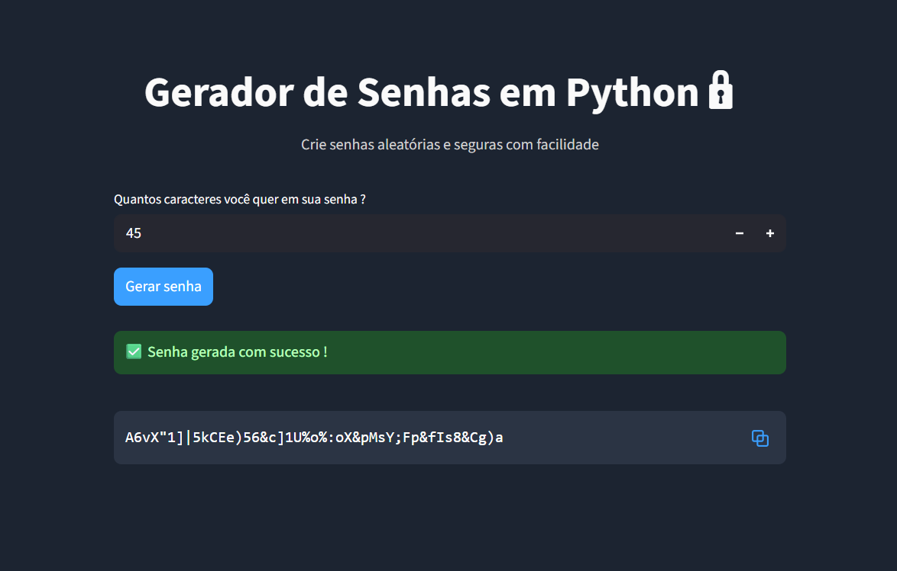

# Gerador de Senhas Aleatórias

Aplicação desenvolvida em **Python** com **Streamlit**, que gera senhas aleatórias e com tamanho personalizável de forma simples, rápida e totalmente online. O objetivo do projeto é oferecer uma ferramenta prática para criação de senhas fortes, combinando **segurança**, **usabilidade** e **design moderno**.

---

## 🌐 Acesse o Projeto Online

[Clique aqui para usar o Gerador. (Ctrl + clique para abrir em uma nova aba)](https://matheus-machado-gerador-senhas.streamlit.app/)

Nenhuma instalação ou download é necessário, o projeto é executado diretamente no navegador por meio do **Streamlit Cloud**, garantindo fácil acesso e total compatibilidade com qualquer dispositivo.

---

## ⚙️ Tecnologias Utilizadas

### 🐍 **Python 3**

Todo o processo de geração de senhas e controle da lógica foi desenvolvido em Python.

### 💻 **Streamlit**

Framework utilizado para transformar scripts Python em aplicações web interativas de maneira rápida e intuitiva.  

### 🔢 **Biblioteca `random`**

Responsável pela seleção aleatória dos caracteres que compõem as senhas.  

### 🔤 **Biblioteca `string`**

Utilizada para acessar coleções pré-definidas de caracteres, como letras maiúsculas e minúsculas (`string.ascii_letters`), dígitos (`string.digits`) e símbolos especiais (`string.punctuation`).

---

## 🧠 Como o Gerador Funciona

O sistema combina as bibliotecas `random` e `string` para criar senhas fortes a partir dos conjuntos de caracteres selecionados.  
O usuário pode ajustar o **tamanho da senha** de acordo com sua necessidade, e o algoritmo realiza uma mistura aleatória dos caracteres disponíveis, garantindo variedade e segurança.

Por trás da interface, o fluxo é simples e eficiente:

1. O usuário informa o comprimento desejado da senha.   
2. A função `random.choice()` escolhe aleatoriamente os caracteres.  
3. A senha final é exibida instantaneamente na interface do Streamlit.  

Esse processo garante rapidez e resultados diferentes a cada execução.

---

## Interface e Experiência do Usuário

A interface foi desenvolvida com **foco na simplicidade e legibilidade**.  
O tema escuro foi definido para oferecer uma melhor experiência visual, reduzindo o cansaço ocular e proporcionando um design mais moderno.  
Toda a interação ocorre em tempo real, com atualizações automáticas à medida que o usuário modifica os parâmetros.

---

## Como Utilizar

1. Acesse o link do projeto: [https://matheus-machado-gerador-senhas.streamlit.app/](https://matheus-machado-gerador-senhas.streamlit.app/)
2. Escolha o tamanho desejado para a senha.  
3. Clique para gerar e veja o resultado instantaneamente.  
4. Copie sua senha e utilize onde desejar!

Não é necessário instalar nada, apenas ter acesso à internet.

---

## Autor

**Matheus Machado dos Santos** 

Desenvolvido como um projeto independente, com foco em **Python**, **Streamlit** e boas práticas de programação.

---
